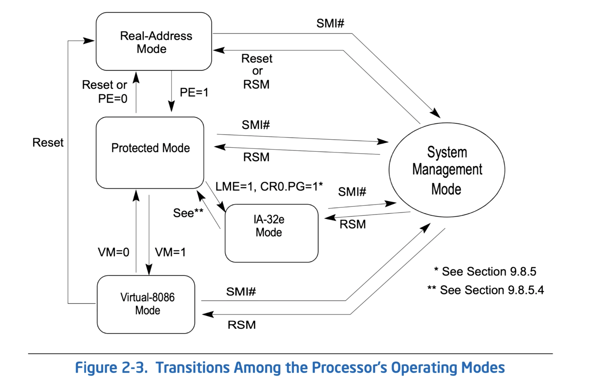

# DAY 2 : Interrupts, IDT, GDT




- Intel Processor Execution Modes - Architecture 2001: Intel x86-64 OS Internals <https://www.youtube.com/watch?v=tIigDA744mw&list=PLUFkSN0XLZ-myVyCmMvfz_W5Z5SauI3cN&index=3>
- intermezzOS *Transitioning to Long Mode* : <https://intermezzos.github.io/book/first-edition/transitioning-to-long-mode.html>
- 老司机带你探索内核编译系统 <https://richardweiyang-2.gitbook.io/kernel-exploring/00_index>
- Linux Inside <https://0xax.gitbooks.io/linux-insides/content/>
- Building an OS - 8 - Interrupts, IDT, GDT <https://www.youtube.com/watch?v=5LbXClJhxcs>
- Entering 64-Bit Long Mode | Make a 64 bit OS From Scratch!! | Part 5 <https://www.youtube.com/watch?v=sk_ngabpwXQ>
- Write Your Own 64-bit Operating System Kernel #2 - Stack, long mode and printing using C code <https://www.youtube.com/watch?v=wz9CZBeXR6U>
- CS 134 OS—5.7 Paging on x86 <https://www.youtube.com/watch?v=dn55T2q63RU>
- Writing an OS in Rust (First Edition) - Entering Long Mode <https://os.phil-opp.com/entering-longmode/>
- 《操作系统真象》
- 《X86从实模式到保护模式》

## intermezzOS 这本书

这本书不错，教你如何用 GRUB 引导自己的系统 和 用 Rust 写自己的系统。

<https://intermezzos.github.io/book/first-edition/paging.html>


## Real Mode (segment)

The earliest X86 application, for example **BIOS**. 

## 32-bit Protected Mode 

The mode for 32-bit applications (see how to transition from protected mode to long mode)

- Set up something called ‘paging’.
- Set up something called a ‘GDT’.
- Jump to long mode.

## 64-bit Long Mode 

For backward compatibility, `x86_64` itself is a new mode. 

As this mode is for 64-bit applications, it is called **Long Mode**. 

<https://wiki.osdev.org/Setting_Up_Long_Mode>


In conclusion, the state transition diagram looks like 

```
Booting     -->     Real Mode        --> Protected Mode (32-bits) --> Long Mode (64-bits)

            -->  BIOS and Bootloader --> Bootloader / OS          --> OS
```


## Enclave Mode 

Some processor models are equipped with security extensions, for example SGX or TrustZone. 


